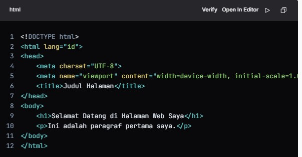

<h1>Belajar dasar coding HTML untuk pemula</h1>

<h2> Apa itu HTML?</h2>

HTML (HyperText Markup Language) adalah bahasa markup yang digunakan untuk membuat struktur halaman web. HTML menggunakan tag untuk mendefinisikan elemen-elemen di dalam halaman.

<h2>Stuktur dasar HTML</h2>

 Berikut sruktur dasar dari documen HTML:

<h2>Penjelasan struktur</h2>

  <oL>
    <Li>'!DOCTYPE html:' Menyatakan bahwa dokumen ini adalah dokumen HTML5.</Li>
    <Li>'html lang="id":' Elemen root dari dokumen HTML. Atribut lang menunjukkan bahasa yang digunakan.</Li>
      <Li>'head: 'Bagian ini berisi informasi tentang dokumen, seperti judul dan pengaturan karakter.</Li>
        <Li>'meta charset="UTF-8":' Menentukan pengkodean karakter yang digunakan.</Li>
    <li>'title': Judul halaman yang muncul di tab browser.</li>
    <Li>'body': Bagian ini berisi konten yang akan ditampilkan di halaman web.</Li>
  </oL>

<h2>Elemen dasa HTML</h2>

Berikut adalah beberapa elemen dasar yang sering digunakan dalam HTML:

<h3>Heading</h3>
 
  <h3>Paragraf</h3> 
 <h3>Tautan</h3>
 <h3>Gambar</h3>

