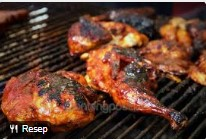

<h1>Cara mebuat ayam bakar</h1>

Mulya Rahmadani&Nabila/2024

<h2>Bahan-bahan yang perlu disiapkan</h2>

Bahan yangperlu diapkan adalah:
<Li>1 ekom ayam, potong sesuai selera.</Li>

*Bumbu halus
<Li>6 siung bawang merah</Li>
<Li>4 siung bawang putih</Li>
<Li>3 buah cabe merah keriting (sesuai selera)</Li>
<Li>2 ruas kunyit</Li>
<Li>1 ruas jahe</L>
<Li>1 sdt ketumbar bubuk</Li>
<Li>1/2 sdt merica bubuk</Li>

*Bahan tambahan
<Li>4 lembar daun salam</Li>
<Li>2 batang serai, gebrek</Li>
<Li>2 sdm gula merah</Li>
<Li>Garam secukupnya</Li>
<Li>Minyak untuk memanggang</Li>

<h2>Cara membuat</h2>

  <oL>
    <Li>Haluskan semua bumbu menggunakan blender atau ulekan hingga benar-benar halus.</Li>
    <Li>Lumuri ayam dengan bumbu halus hingga rata. Diamkan selama minimal 30 menit agar bumbu meresap.</Li>
    <Li>Panaskan teflon atau panggangan. Olesi dengan sedikit minyak. Panggang ayam hingga matang dan berwarna kecoklatan. Bolak-balik agar matang merata.</Li>
    
    <Li>Sambil memanggang, siapkan bumbu tambahan. Campurkan daun salam, serai, gula merah, kecap manis,dan garam.</Li>
    <Li>Sesekali olesi ayam dengan bumbu tambahan agar lebih harum dan berwarna.</Li>
    <Li>Setelah matang, angkat ayam dan sajikan selagi hangat dengan nasi putih, sambal dan lalapan.</Li>
    
  </oL>

	

